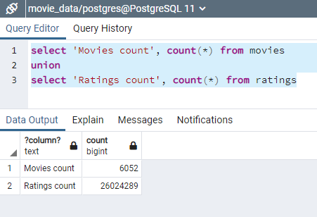

# Movies-ETL

## Overview

This project uses the Pandas, numpy, SQLAlchemy, and json python libraries to extract data about movies, transform it, and load it into a PostgreSQL database. It involved working with very large dataset, as the ratings data had more than 26 million rows, as seen in the screenshot above. 

## Process

We performed an [initial analysis](initial_analysis.ipynb) to go through the data, and figure out what we needed to do in order to clean it up to a satisfactory level.

### Extract

The kaggle_metadata a ratings files were downloaded in csv format from [Kaggle](https://www.kaggle.com). The wikipedia data was given to us in a JSON format. The data from Kaggle was able to be read directly into DataFrames, and the wikipedia data had to be pulled out using the json library.

### Transform

Most of the cleaning had to be done on the wikipedia data. Since it was data from a web scrape it was messy, and had many columns with different names for the same information. in our [ETL_clean_wiki_movies.ipynb](ETL_clean_movies.ipynb) file we created a function `extract_transform_load()` to read in the data and begine cleaning it. TV shows were removed from the wiki data, columns were renamed to be consistent, duplicate entries were dropped, and data was transformed into a consistent format.

The kaggle data was already fairly clean, and in [ETL_clean_kaggle_data.ipynb](ETL_clean_kaggle_data.ipynb) we had to transform the values of some of the columns into the proper data type. Then we merged the kaggle data with the wiki data in a way that preserved the most useful information.

The ratings data was transformed in the same file, and pivoted to provide counts of each rating a movie received. This was then merged into the previous data. 

### Load

In order to make our clean data accessible we connected to a PostgreSQL database in [ETL_create_database.ipynb](ETL_create_database.ipynb) and uploaded the final movies DataFrame. Our original ratings data was too large to upload at once without a timeout, so we chunked into one million row pieces and uploaded it to the database that way.
